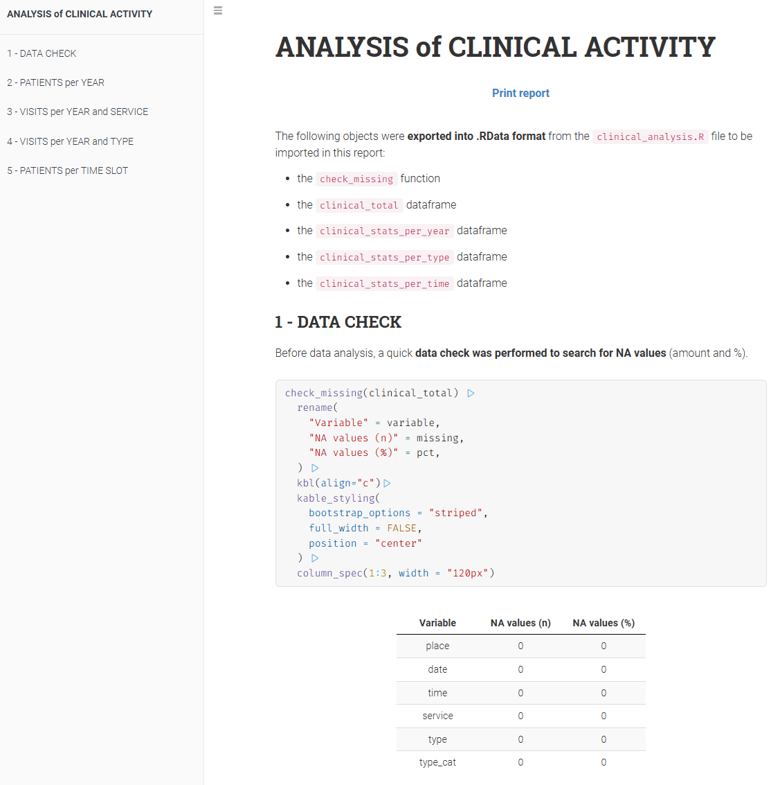

# **CLINICAL ACTIVITY ANALYSIS**

**Author:** Dr. Andrea PECCATI

**Output Format:** Interactive Robobook (HTML)

This project provides an automated end-to-end workflow for processing, analyzing, and visualizing clinical activity data.

It transforms raw, multi-source clinical records into a high-quality, interactive HTML report.

## REPORT PREVIEW



## PROJECT STRUCTURE

-   **`clinical_analysis.R`**:\
    The core engine. It handles library dependencies, data ingestion, cleaning, and statistical computation.

-   **`clinical_analysis.Rmd`**:\
    The reporting layer. It imports the processed environment and renders the visual dashboard using `ggplot2` and `kableExtra`.

-   **`data/`** *(Directory)*:\
    Expected location for anonymized CSV files.\
    [Note: This folder is typically excluded from version control to maintain data silos]

-   **`clinical_analysis.RData`**\
    The bridge file containing exported functions and dataframes used for report generation

## PRIVACY AND DATA PROTECTION

-   All data utilized in this project has been **fully anonymized** prior to the creation of the source CSV files to ensure patient privacy

-   There is **no sensitive personal information** (PII) or health-protected identifiers within the datasets

-   The analysis is performed exclusively on de-identified variables such as visit types, timestamps, and payment categories

## INSTRUCTIONS

1.  **Prepare Data**\
    Place your anonymized CSV files (formatted with `;` separator) into the `/data` folder

2.  **Process:**\
    Execute the R script to clean and transform the data:

    ```         
    source("clinical_analysis.R")
    ```

3.  **Render**\
    Knit the .RMarkdown file in RStudio or via console:

    ```         
    rmarkdown::render("clinical_analysis.Rmd")
    ```

## KEY FEATURES

-   **Automated Data Ingestion**\
    Scans the `/data` directory for CSV files with specific facility prefixes

-   **Multi-Source Integration**\
    Automatically detects and merges CSV files from different facilities based on unique 3-letter filename prefixes

-   **Integrity Auditing**\
    Uses a custom `check_missing()` function to monitor data quality and NA percentages

-   **Temporal Intelligence**\
    Groups visits into 2-hour slots (from 08:00 to 20:00) to analyze peak facility usage

-   **Service Classification**\
    Detailed breakdown of visit types (e.g., First visits, Follow-ups, Hip US)

-   **Economic Insights**\
    Distinguishes between National Health System, Private Practice and Insurance visits

-   **Professional Reporting**\
    Generates a mobile-responsive "Robobook" report with interactive tables, stacked bar charts, and cumulative growth metrics

## TECH STACK

-   **Language:** R (verison ≥ 4.1.0 required for the native pipe operator `|>`)

-   **RStudio:** Recommended for knitting the `.Rmd` report

-   **Operating System:** Windows, macOS, or Linux

-   **Manipulation:** `tidyverse` (dplyr, purrr, tidyr), `lubridate`

-   **Visualization:** `ggplot2`

-   **Table Formatting:** `kableExtra`

-   **UI/UX:** `rmdformats` (Robobook template)

## 
